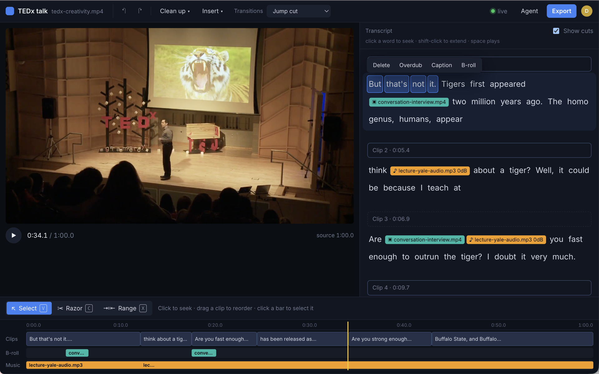

# type-n-stitch

Edit audio and video by editing the words. Drop in a recording, get a word-level transcript,
delete the words you don't want, replace a phrase with a cloned-voice overdub, and export the
stitched result. It's a small homage to [Descript](https://www.descript.com)'s text-based editing,
built by me in an afternoon with Claude Code: a Rust media engine, an axum server, and a React
front end, all running locally on whisper.cpp, ffmpeg and VoiceStudio.



## How it works

Every project is a source file plus an **edit list**. Nothing is ever modified in place.

1. **Transcribe.** ffmpeg converts the upload to 16 kHz mono; `whisper-cli` runs with
   `-ml 1 -sow` so every segment is one word with millisecond offsets.
2. **Edit.** The transcript is a stream of clickable words. Deleting a run of words adds a
   `cut` from the first word's start to the _next_ word's start, so the pause after the last
   deleted word goes with it and no half-gaps are left behind. Overdubbing a run sends new text
   to VoiceStudio and adds an `overdub` edit carrying the WAV and its duration. Every change is
   an operation appended to the project's log in SQLite; the edit list is the fold of that log,
   and undo appends an `undo` targeting your own operation.
3. **Preview.** The browser plays the original file and honours the edit list live: an
   animation-frame loop seeks past cuts as the playhead reaches them, and for an overdub it
   pauses the picture on the first frame, plays the WAV through a second `Audio` element, then
   resumes at the end of the range.
4. **Export.** The Rust engine turns the edit list into a timeline of output pieces, then into
   one ffmpeg `filter_complex`: `trim`/`atrim` + `setpts` per kept piece, a `select`/`tpad`
   freeze-frame over the synthesized audio per overdub, and a `concat`. ffmpeg renders an mp4
   (or mp3/wav for audio-only sources) and the UI offers a download.

```
 ┌────────────────────────────┐        ┌────────────────────────────────────────┐
 │  client/  React + TS       │        │  server/  Rust, axum                   │
 │  ─────────────────────     │  /api  │  ────────────────────────────────────  │
 │  Dropzone → upload         │ ─────▶ │  POST /api/auth/{reg,login,logout}, /me│
 │  Transcript (word tokens)  │        │  GET/POST /api/projects  (list, upload)│
 │  editor reducer + undo     │        │  GET  /api/projects/:id  (media + fold)│
 │  usePlayback: live skip    │        │  POST /api/projects/:id/ops (append)   │
 │  suggest.ts (fillers,      │        │  POST /api/projects/:id/{transcribe,…} │
 │    pauses, preview mirror) │        │  GET  …/export/:job/progress           │
 │  editlist.ts (preview      │ ◀───── │  GET  /data/…       (source, wav, mp4) │
 │    mirror of the engine)   │ /data  │                                        │
 └────────────────────────────┘        │  engine/  Rust library                 │
                                       │  SQLite (sqlx): accounts, op log       │
                                       │  ─────────────────────────────────     │
                                       │  Word / Edit types (serde)             │
                                       │  normalize_cuts · kept_segments        │
                                       │  timeline · source⇄output remaps       │
                                       │  parse_whisper_json · build_ffmpeg_args│
                                       └───────┬──────────┬──────────┬──────────┘
                                               │          │          │
                                          whisper-cli   ffmpeg   VoiceStudio
                                          (whisper.cpp) ffprobe  (local TTS)
```

Rust for the media engine so the edit-list math and ffmpeg planning are typed, unit-tested and
fast; TypeScript for the UI, where React's state model fits a selection-and-undo editor well.
`client/src/editlist.ts` mirrors the engine's rules for the live preview, but the engine is the
source of truth for export.

## Setup

Requires a Mac (Apple Silicon assumed for the paths below; everything else is portable).

```sh
# tools
brew install ffmpeg whisper-cpp node
curl https://sh.rustup.rs -sSf | sh          # Rust toolchain (cargo)

# a whisper model (large-v3-turbo, ~1.6 GB; any ggml model works)
mkdir -p models
curl -L -o models/ggml-large-v3-turbo.bin \
  https://huggingface.co/ggerganov/whisper.cpp/resolve/main/ggml-large-v3-turbo.bin

# the app
git clone https://github.com/jonyen/type-n-stitch && cd type-n-stitch
npm install
scripts/setup-diarization.sh   # optional: speaker labels (~60 MB, local models)
npm run library   # optional: starter clips (needs yt-dlp: brew install yt-dlp)
npm run dev
```

Open <http://localhost:5174>. The Rust server listens on 5175 and Vite proxies `/api`,
`/data` and `/library` to it. The start screen lists the sample library under the drop zone;
see [samples/README.md](samples/README.md) for what's in it and where it comes from.

### Accounts

The first visit asks you to create an account. To create an admin non-interactively and
adopt any media already under `DATA_DIR`, set `ADMIN_EMAIL` and `ADMIN_PASSWORD` before
starting the server. `ADMIN_PASSWORD` is only used when the admin account is first created;
changing it later has no effect (there is no password-reset flow yet; edit the `users` row if
you must). The database lives at `$DATA_DIR/type-n-stitch.db`; override with `DATABASE_URL`.
Registration is open to anyone who can reach the server — put it behind your own network or
proxy. The client mirrors the engine's edit rules for the live preview, but the server's fold
of the operation log is what export renders.

**Overdub** needs a local OpenAI-compatible speech endpoint. I use VoiceStudio with a cloned
voice profile; anything that answers `POST /v1/audio/speech` with `response_format: "wav"` will
do. Without it, the Overdub button explains what's missing and everything else keeps working.

| Variable                     | Default                                                          | Purpose                                                 |
| ---------------------------- | ---------------------------------------------------------------- | ------------------------------------------------------- |
| `WHISPER_MODEL`              | `models/ggml-large-v3-turbo.bin`                                 | ggml model file for whisper-cli                         |
| `WHISPER_BIN`                | `whisper-cli`                                                    | whisper.cpp binary                                      |
| `DIARIZE_BIN`                | `models/diarization/bin/sherpa-onnx-offline-speaker-diarization` | speaker diarization binary                              |
| `DIARIZE_SEGMENTATION_MODEL` | `models/diarization/segmentation.onnx`                           | pyannote segmentation model                             |
| `DIARIZE_EMBEDDING_MODEL`    | `models/diarization/embedding.onnx`                              | speaker embedding model                                 |
| `DIARIZE_THRESHOLD`          | `0.9`                                                            | clustering cut-off; raise it if one voice splits in two |
| `TTS_BASE_URL`               | `http://localhost:3900/v1`                                       | OpenAI-compatible TTS base URL                          |
| `TTS_VOICE`                  | `513bb606`                                                       | voice id sent to the TTS server                         |
| `DATA_DIR`                   | `server/data`                                                    | uploads, transcripts and renders                        |
| `SAMPLES_DIR`                | `samples`                                                        | sample library manifest and clips                       |
| `PORT`                       | `5175`                                                           | server port                                             |
| `DATABASE_URL`               | `$DATA_DIR/type-n-stitch.db`                                     | SQLite database location                                |
| `ADMIN_EMAIL`                | unset                                                            | creates an admin account on first start                 |
| `ADMIN_PASSWORD`             | unset                                                            | password for that first admin account                   |

## Scripts

| Command           | What it does                                                        |
| ----------------- | ------------------------------------------------------------------- |
| `npm run dev`     | `cargo run -p server` and the Vite client, side by side             |
| `npm run library` | makes `samples/sample.mp4` and downloads the sample library         |
| `npm test`        | `cargo test` (engine and server suites) and the client's vitest run |
| `npm run lint`    | `cargo fmt --check`, `cargo clippy -D warnings`, eslint, prettier   |
| `npm run build`   | release build of the server and a production client bundle          |
| `npm run format`  | `cargo fmt` and `prettier --write`                                  |

The engine's render test needs `samples/sample.mp4` (see `samples/README.md`); it skips itself
if the clip is missing.

## Editing tools

- **Remove fillers.** One click cuts every `um`, `uh`, `hmm`, `er`, `ah` (and, with the toggle on,
  `you know` / `I mean`). The button shows how many are left, and one undo restores them all.
  Whisper is trained on cleaned-up transcripts and drops fillers by default, so the engine primes
  the decoder with a disfluent prompt; without it this button finds nothing on real recordings.
- **Tighten pauses.** Any silence longer than 0.6 s is cut down to 0.25 s, and leading silence
  past 0.5 s goes too. Pauses come from ffmpeg `silencedetect` on the audio, not from word gaps:
  whisper.cpp folds silence into the neighbouring word, so its timestamps never show a gap.
- **Speakers.** After transcription, sherpa-onnx (pyannote segmentation + TitaNet speaker
  embeddings, all local) works out who is talking when, and the transcript splits into turns
  with a coloured label per speaker. Click a label to rename that speaker everywhere; names are
  remembered in the browser. Clips with one voice show no labels. Needs
  `scripts/setup-diarization.sh`; without it the transcript stays unsplit.
- **Scrubber preview.** Hover or drag the timeline to see the frame at that point, dimmed and
  marked when it falls inside a cut.
- **Drag to select.** Press on a word and drag across the run, or shift-click, or use the arrow
  keys (shift extends).
- **Show cuts.** Off hides struck words so the transcript reads the way the output will sound;
  a `…` marks each removed run.
- **Export with progress.** Export starts ffmpeg in the background and polls its progress; the
  bar fills against the planned output length, then the download link shows duration and size.
- **Stats line.** Source length, output length, seconds removed, cut and overdub counts.

Suggestions are computed by the Rust engine (`engine/src/suggest.rs`, served at
`POST /api/projects/:id/suggest`) with the same rules mirrored in `client/src/suggest.ts` for an
instant preview.

## Keyboard

`Delete` / `Backspace` cuts the selection · `⌘Z` / `Ctrl-Z` undoes · `Space` plays and pauses ·
`Esc` clears the selection · `←` `→` move the selection, with `Shift` extend it · click a word to
seek to it · shift-click or drag to select a run.

## Limitations

- English only (`-l en`), and whisper's word boundaries are what they are: a cut
  can clip a consonant. Descript-grade word alignment is a much deeper problem.
- Speaker turns come from a separate model, so a turn boundary can land a word early or late,
  and background voices or music can show up as an extra speaker.
- An overdub always freezes the picture on the range's first frame for the length of the new
  audio, both in the preview and in the export. There is no lip-sync or time-stretching.
- The preview skips cuts on the browser's clock, so a cut boundary can bleed a frame or two;
  the export is frame-accurate.
- Exports re-encode the whole file with libx264. Fine for clips, slow for an hour of 4K.
- `/data/<media id>/…` (source media, transcripts, overdub audio, exports) is served without
  authentication — anyone who learns a media id can fetch the files. The server binds to
  127.0.0.1, so this is only reachable from your machine; a per-project media route is planned.

## License

MIT © Jonathan Yen
